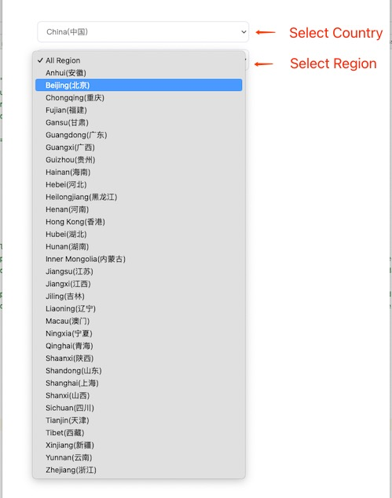

## 国家与地区选择组件
使用 Vue3, Tailwind CSS, TypeScript 实现。

### 如何使用
你需要使用到3个文件，./src/components/ui/inputs/country-region-select/下面的country-select.vue和region-select.vue，还有数据文件：./src/countryRegionData.ts
然后在你自己的vue中，例如：

    
    
    <template>
    
      

    
        

          <country-select placeholder="All Country" :country="countrySelected" @countrySelected="country => countrySelected = country"
                          class-name="h-8 mb-4 border-2  px-4 rounded-sm bg-transparent text-sm text-black opacity-60 dark:text-white dark:opacity-70 font-normal leading-4 tracking-[0.16px]"
          />
          <region-select  placeholder="All Region"  :country="countrySelected" :region="regionSelected" @regionSelected="region => regionSelected = region"
                          class-name="h-8 border-2 px-4 rounded-sm bg-transparent text-sm text-black opacity-60 dark:text-white dark:opacity-70 font-normal leading-4 tracking-[0.16px]"
          />
        

    
      

    
    </template>

### 效果

